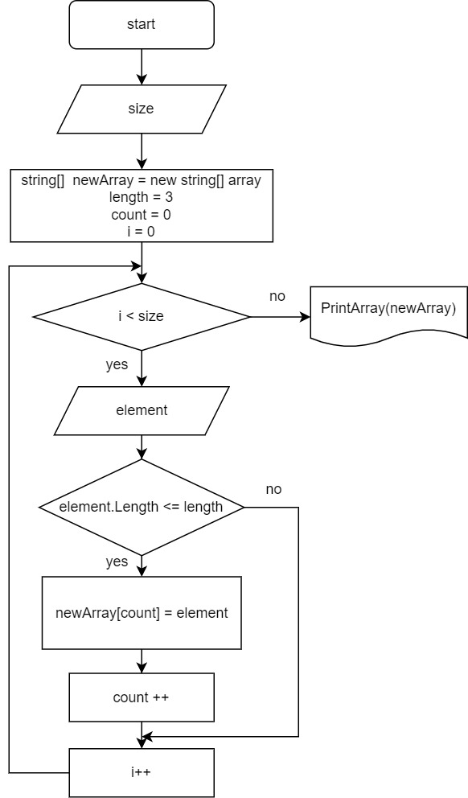

# **Итоговая проверочная работа**
## Задание:

1. Создать репозиторий в GitHub
2. Нарисовать блок-схему алгоритма
3. Снабдить репозиторий оформленным текстовым описанием решения (файл README.md)
4. Написать программу, решающую поставленную задачу
5. Использовать контроль версий в работе над этим проектом

**Задача:**

Написать программу, которая из имеющегося массива строк формирует массив из строк, длина которых меньше либо равна 3 символа. Первоначальный массив можно ввести с клавиатуры, либо задать на старте выполнения алгоритма. При решении не рекомендуется пользоваться коллекциями, лучше обойтись исключительно массивами.

## Выполнение работы

1. Создан репозиторий в GitHub
2. Составлена блок-схема алгоритма решения задачи

    

3. Ход решения задачи:
    * Создаем массив и запрашиваем у пользователя количество элементов в массиве.
    * Вводим вспомогательную переменную count, в которую запишем количество строк, длина которых меньше или равна 3 символам
    * Создаем цикл, который существует при условии, что индекс элемента меньше размера массива. Внутри цикла запрашиваем у пользователя элементы массива. Далее с помощью условия (if) проходим по каждому элементу и проверяем длину строки(элемента). Если длина меньше или равна 3, запоминаем элемент, увеличиваем переменную count и счетчик цикла (i). Если количество символов в элементе массива болше 3, то увеличиваем только счетчик массива.
    * Создаем массив размером count, элементами которого будут строки, состоящие из 3-х и менее символов.
    * Когда цикл завершен (т.е. все элементы проверены на количество символов), выводим массив в консоль.

